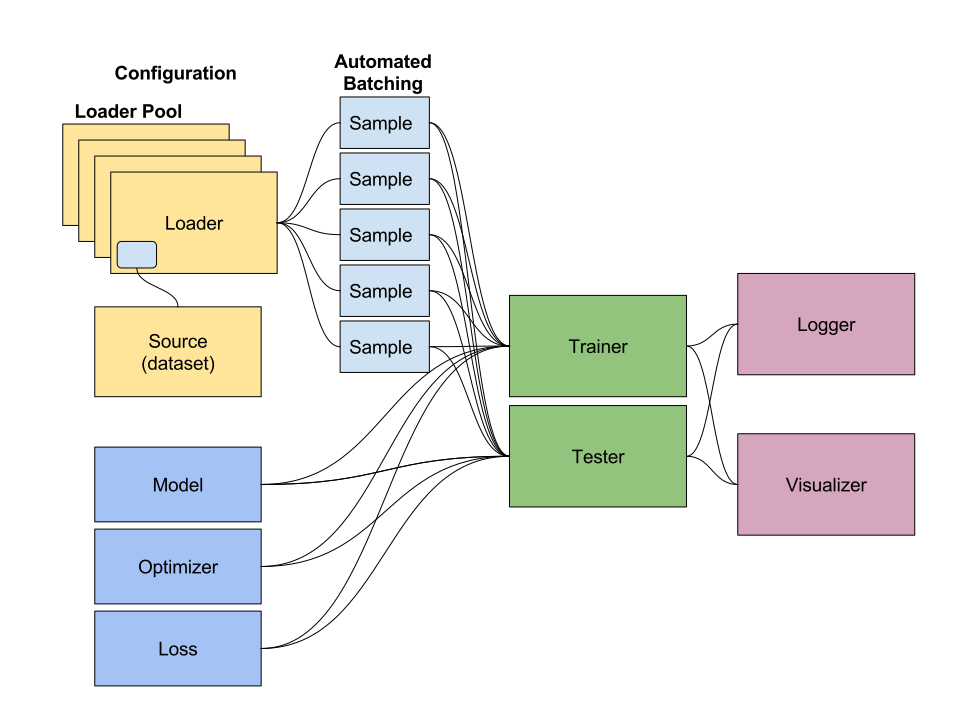

# A pytorch library for building neurals networks for visual recognition, encoding, and detection tasks

There are many common challenges with training deep neural nets for vision tasks when confronted with real world problems beyond using MNIST and Imagenet datasets, such as properly handling the loading of large images for batched training without bottlenecking performance, augmenting samples with perturbations, generating and storing visualizations from different parts of the pipeline. This library tries address some of these issues in a scalable way allow the user to quickly experiment with different datasets and different models in state-of-the-art deeplearning research.

## Features

* Threaded loader pool to elimiante dataloading time during training
* Flexible image class abstracts away intensity scaling and byte ordering differences between PIL images and torch tensors
* Utilities to deal with bounding box regression and pixel masking targets
* Visualization and Logging tools allows json data and images to be recorded from anywhere in the pipeline
* All tools built to support dynamic models (tensor sizes are determined at runtime given inputs, this is a frequent issue when you don't want to just build models that support a single resolution)
* Code as configuration. A single python script fully defines all components that can used to train and test a model.

# Running Locally for on Native Ubuntu 16.04

Install: `sudo bash pytlib/install.sh`

Start up virtualenv: `cd pytlib; source pytenv/bin/activate`

Run the trainer: `python run/trainer.py ...`

# Running with Docker
Create the docker container run `docker-compose up -d --force-recreate --build`

Now run `docker ps` you should see a container running.

Now to attach a shell script to the container run `docker exec -it <name_of_docker_process> /bin/bash`.

Export your python path by running `export PYTHONPATH="${PYTHONPATH}:/pytlib"`
Activate your virtualenv with `source pytenv/bin/activate`

Note: CUDA support in docker not tested yet.
